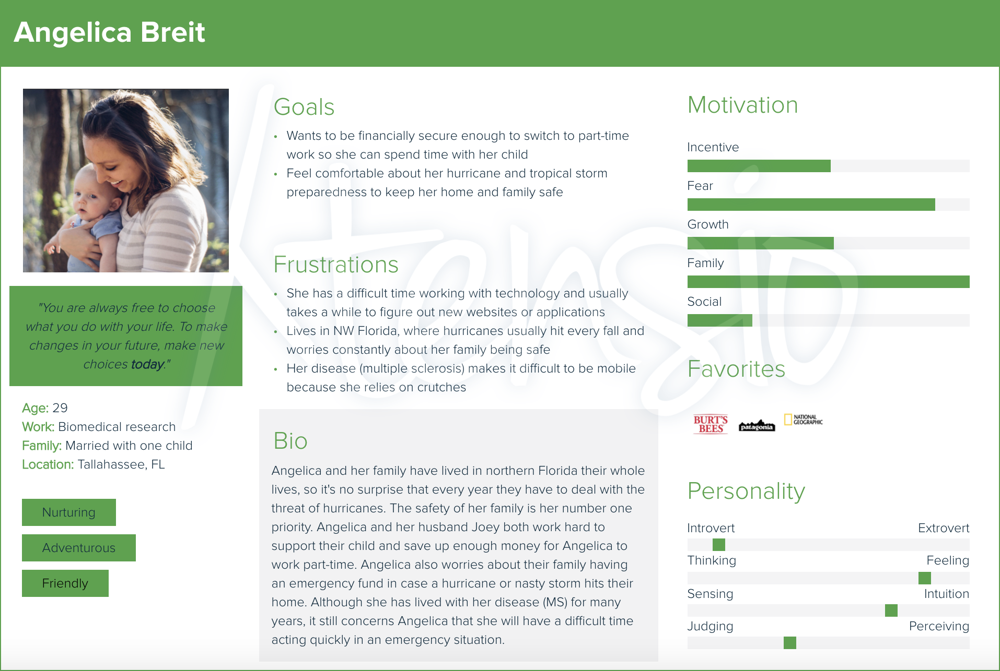
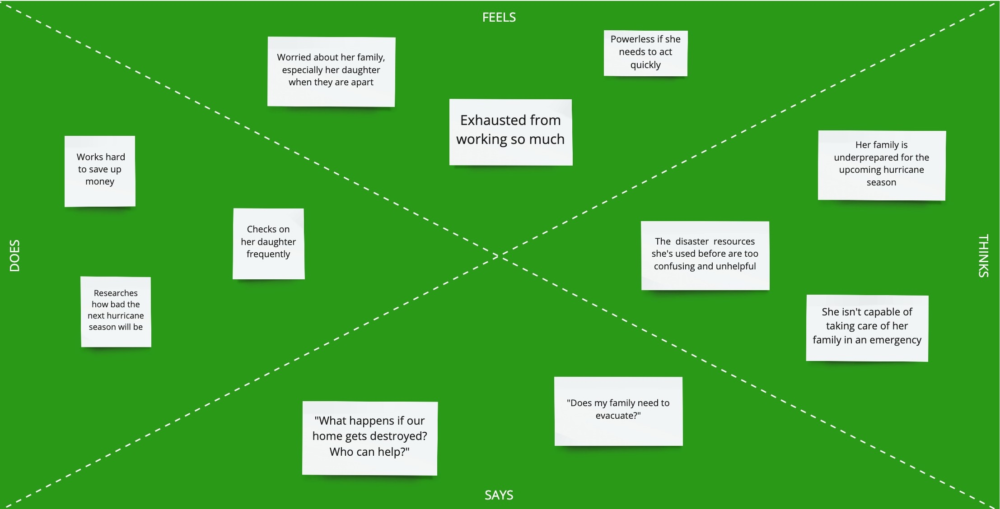
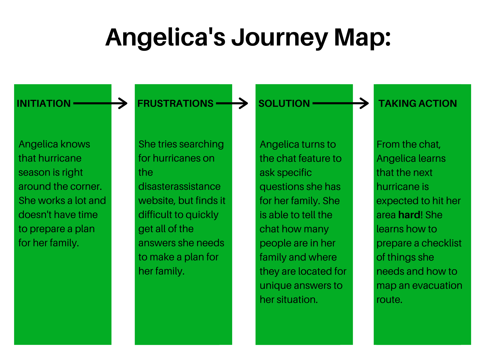
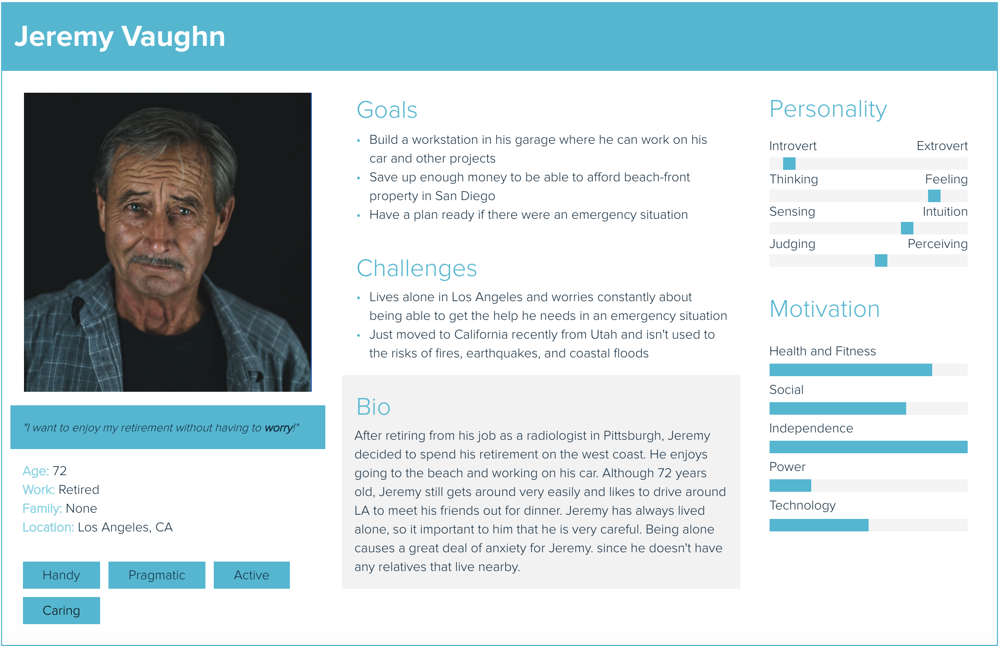
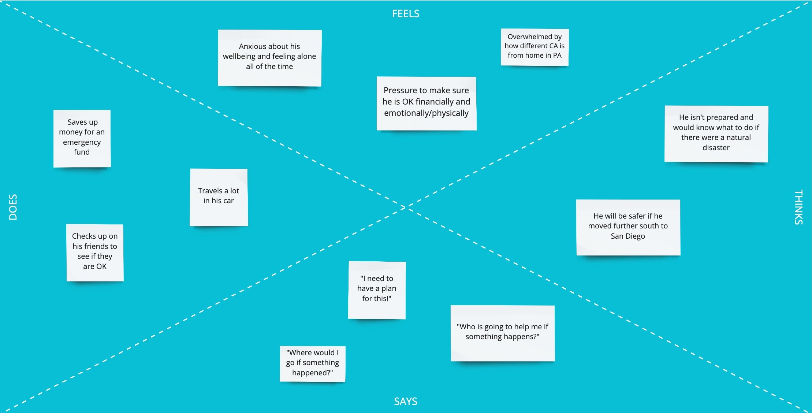
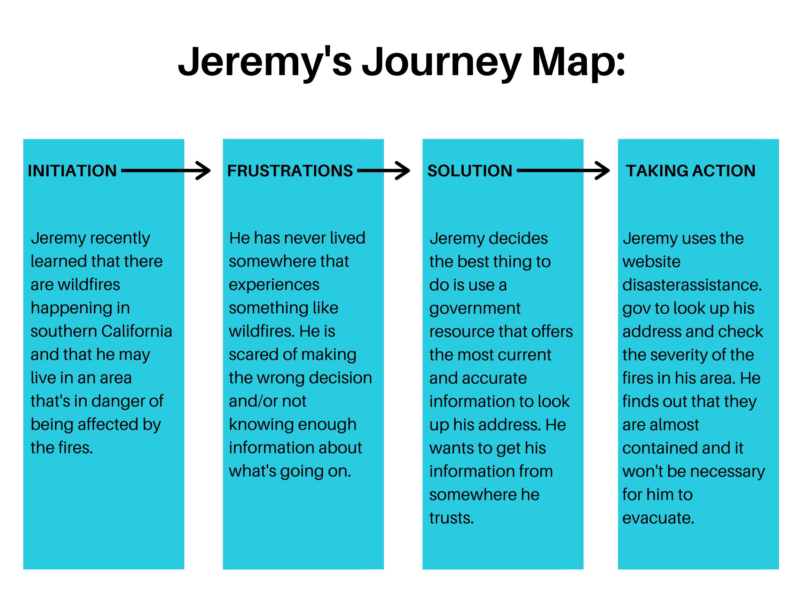

## Assignment 5: Persona and Scenario

### Purpose of UX Storytelling
Storytelling in UX is crucial to make sure your design team is keeping the user's needs front and center. Through storytelling, your team can concretely visualize **who** they are designing for and **why** their design is important.

***
### Key Design Features
1. An interactive visualization that tells users the severity of a disaster in their area and decisions they need to make immediately (if any)
2. Chat function that uses AI to guide the user to the right place to get the information they need

***
### Angelica Breit:
#### Persona

#### Empathy Map

#### Scenario
**Why is Angelica using this site?**
>Angelica is using this site because she wants to understand how severe the hurricanes and tropical storms are this season. She lives in an area that historically gets hit hard by these types of natural disasters and she wants to make sure that her and her family are prepared.

**How is Angelica using this site?**
>She is using the site to search for hurricanes to see what the different categories mean so she can understand what she heard on the news recently. She also wants to figure out if others in her area are evacuating or if it is safe enough to remain where they are and just shelter in place.

#### Journey Map

***
### Jeremy Vaughn:
#### Persona

#### Empathy Map

#### Scenario
**Why is Jeremy using this site?**
>One of Jeremy's friends said they smell smoke and see some ash covering the ground where they live. Jeremy isn't sure if he is in an area where there might be a fire. Being new to the area, Jeremy isn't exactly sure what to do if there is a fire in his area.

**How is Jeremy using this site?**
>Jeremy is searching his address to see if he is in an area that is in immediate danger from the fire. Jeremy is also curious if there are resources available that could help him recover his belongings if they got destroyed by the wildfire.

#### Journey Map

