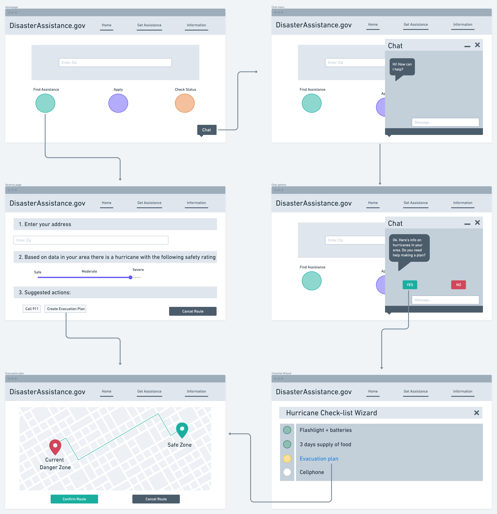
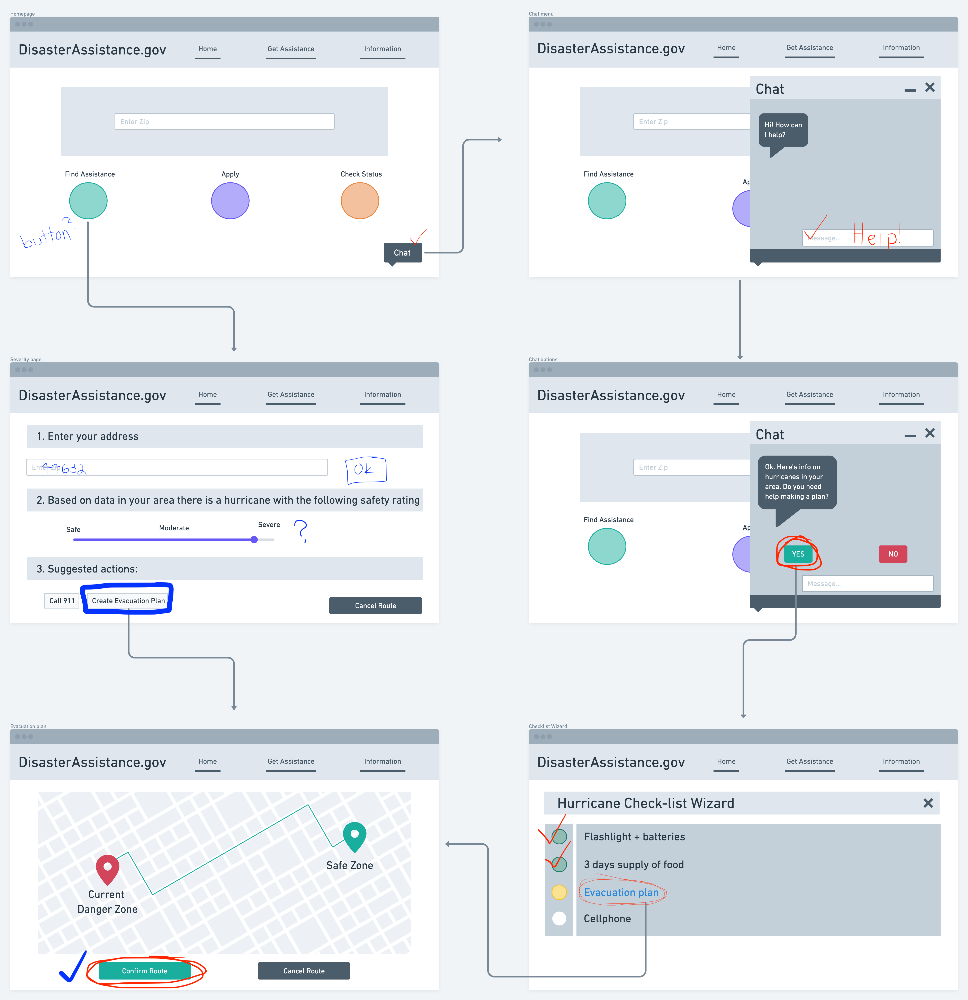

## Assignment 6: Low Fidelity Prototype

### Overview

**Purpose:** The purpose of this low-fidelity prototype is to understand how practical my proposed new features are for my target user demographic.

**User Personas:** The user personas I identified are older users who are likely to find themselves in a disaster and in need of help. These users are most likely to have valuable things in their lives (material or familial) that they would like to protect in the event of a disaster in their area. The goal of these new features is to help those users successfully do that.

**Features & Tasks:** The features and tasks of this low-fi prototype were ideated through various steps of user research, including usability testing of the current DisasterAssistance.gov site, contextual inquiry, and surveying a user interact with related sites. The two features include: an AI chat function that allows user to input data and get real-time answers, a check-list wizard that walks users through important action items, and an evaluation tool that tells a user how severe their situation is based on their location.

### Wireframes and Wireflows

First iteration of wireframes by hand:

***

Wireflows designed in Whimsical:

#### Notes on Wireflow test

### User 1 (Red):
**Task 1: Open chat**
> The user didn't have any difficulties identifying the chat option in the bottom corner of the homepage.

**Task 2: Ask for help using the chat**
> The user knew immediately where the typing bar was and could ask for help using it.

**Task 3: Accept help with creating a plan**
> The user clicked "Yes" when prompted in the chat without any confusion.

**Task 4: Work through the checklist**
> The user surprisingly knew they could check off items on the list. They stopped at "Evacuation plan" and knew to click on the link.

**Task 5: Accept the evacuation route**
> The user had no difficulties interpreting the map routing them from their current location to a safer place.

### User 2 (Blue):
**Task 1: Find help**
> The user noticed "find assistance" but wasn't sure if the green circle was a button or an image.

**Task 2: Enter your information to see how dangerous your area is**
> The user immediately knew where to enter their address, but there was no option to confirm (pressing OK or something) the user also wasn't sure if the slider was supposed to be adjusted by them or if it was supposed to tell them information.

**Task 3: Create an evacuation plan**
> The user was able to understand the map and confirm their route.

### Summary
For the most part, it was fairly easy for the users to complete the tasks I asked them. I completely forgot to incorporate "confirm" or "okay" buttons in some of the frames, which caused some confusion. It seemed like the users understood how to navigate the different frames and weren't too confused by the information presented.

If I were to go back and make adjustments, I would definitely add more buttons confirming selections. I was extra careful to include emergency exit buttons but forgot to include the option for users to confirm the information they enter!
