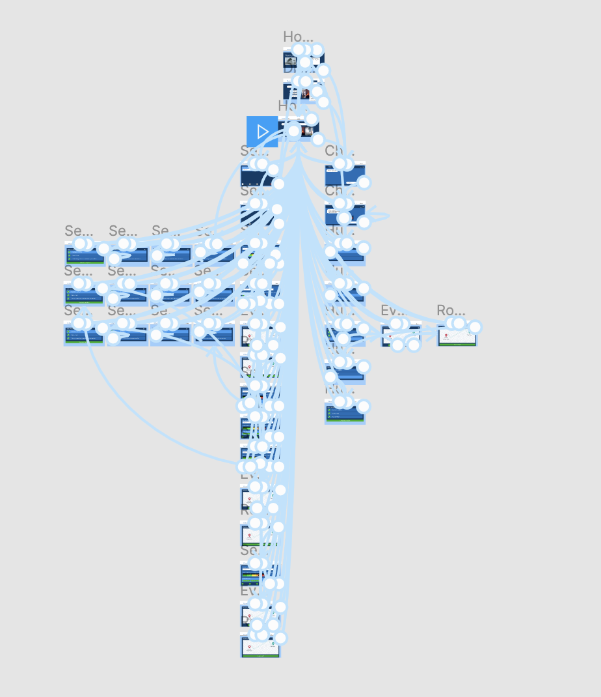

## Assignment 7 Part I: High-Fidelity Prototype
### Description
The three sample screens I have provided include my homepage, checklist feature, and evacuation route mapping feature. For my first iteration (row 1) of the interface designs I wanted to see how the placement of my buttons, text, and pop-up screens looked. In the next iteration (row 2) I tried manipulating the color and typography to see if there were any fonts that stuck out to me as professional and user-friendly. Lastly, (row 3) I boldened the colors, implemented a monochromatic palette, and introduced more buttons so users could have more options to leave a screen or close a pop-up.

### Impression Test
I had a user review the different designs to get feedback along the way. They were able to markup the different screens with their thoughts and suggestions about the design and layout of the graphical interface. Based on their recommendations, I made changes with each iteration until landing on the final design in the final row.

### Compliance
Using the A11y - Color Contrast Checker plugin for Figma, I was able to check the color contrast to ensure my designs were accessibility WCAG2.0 AA compliant.

## Assignment 7 Part II: High-Fidelity Prototype

### Interactive Prototype: [Disastr.gov](https://www.figma.com/file/0jzW7usqVHhQD3B3pS1HXn/Disastr.gov?node-id=0%3A1)

### Brief Summary: Purposes and process
This is a high-fidelity prototype of a fictional government website called Disastr.gov that is meant to help anyone find valuable emergency information about natural disasters. The website has multiple functions, including a chat box to ask for help before, during, or after a disaster. Another function of the site is to help users look up information about disasters in their area and receive critical information about what they should do to prepare for any events happening near them and a check-list wizard that guides them through the preparation process.

### Interactive Prototypes Supported by the System
* List general information about different types of common disasters
* Search your address to see if there are any storms or disasters in your area along with critical information about its severity and suggested actions you should take
* Chat box that lets you ask specific questions that an AI bot will link you to the proper parts of the website that it decides is most helpful for the user
* A "Check-List Wizard" that guides the user through a series of emergency supplies that they are encouraged to have in preparation of a natural disaster
* Save an evacuation route to a nearby safety shelter from the user's home address they entered

### Prototype Design

#### Representative Screen Designs

#### Wireflow with Graphic Designs

### Graphical Interface Design Decisions

#### Color Scheme
Since this website is supposed to be modeled like a government site, I wanted to stick with a very professional looking color scheme and minimalize the amount of colors used. I decided to go with a blue palette for most of the screens and only incorporate colors like green and red for buttons to approve or deny an action. The homepage incorporates red, yellow, and green like a traffic light because it's familiar to all types of users and they can understand that red usually means something bad, yellow is more neutral, and green means something positive. I used an accessibility checker with Figma called the A11y - Color Contrast Checker, so I am certain that my designs would pass an accessibility test. I also used a light blue color to show which step or part of the screen a user was focused on in juxtaposition with a darker blue for other tasks or items in a list. For example, when a user is following the checklist they will see the first item is highlighted in lighter blue, then when they select the next item it will become light blue and the other items become dark blue again. I also used light grays and dark grays to indicate which step a user was on as they completed the process of searching their address to see disasters happening in their area.

#### Typography
For the home page I used a specific font to stand out for the menu to navigate to the home, disasters, and about pages. For the rest of the prototype I use a friendlier font that is consistent throughout, so the site looks professional and governmental.

### Feedback and Reflection

#### In class Cognitive Walkthrough
Using the [feedback](https://docs.google.com/document/d/1T8OhJi4BdyfwxzW_YU4qBjB_k1lbi28syh0660MAOWc/edit?usp=sharing) given from a classmate, I made sure to change my color scheme to indicate a more professional/governmental feel to the site. I also updated the Severity page to include a progress bar that shows the users progress as they locate the information they need.

I also shared my prototype with a few classmates last week during class and got verbal feedback about the aesthetics of the prototype and how I needed to make the functionality of the site more obvious from the homepage. I also included an interactive feature for the "Information" tab on the home menu so users knew the site was for disasters specifically, if that wasn't obvious already :)

As I created more screens, I realized how confusing it can be to remember how each of the screens link together. I often found myself accidentally linking to the wrong screen and when I went back to try using my prototype to complete an action, I'd end up in the wrong place and have to go back and see what I linked incorrectly. I also tried to include more options for users to go back to the homescreen at anytime and tried to be meticulous about where the "back" button vs. the "cancel" button took a user to where they realistically would want to go.
