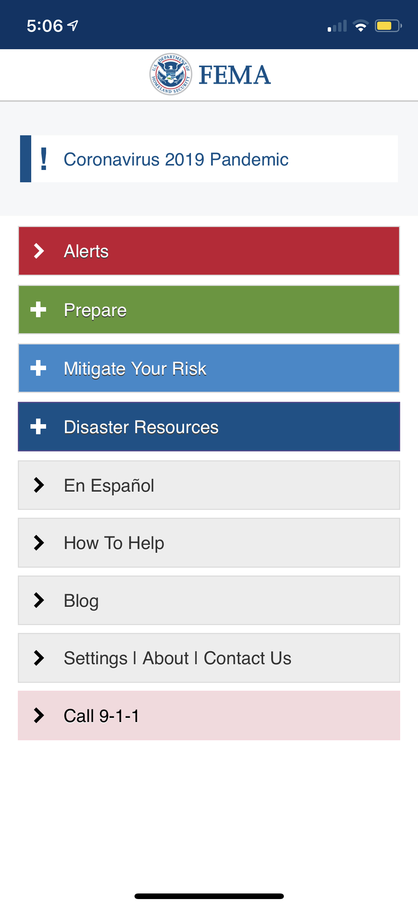
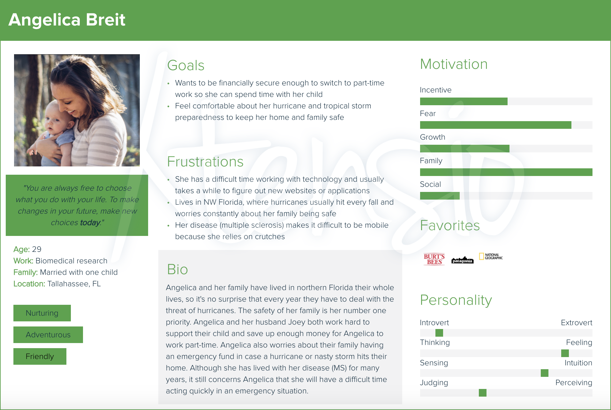
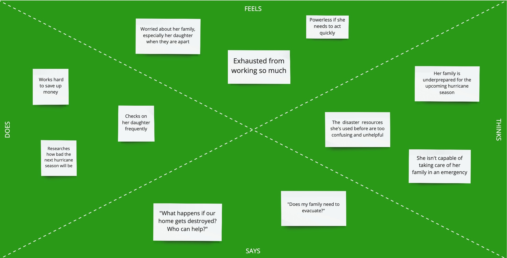
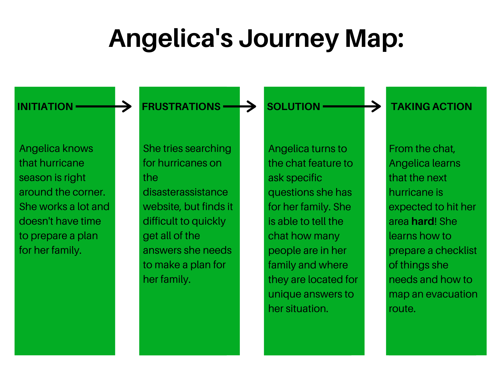
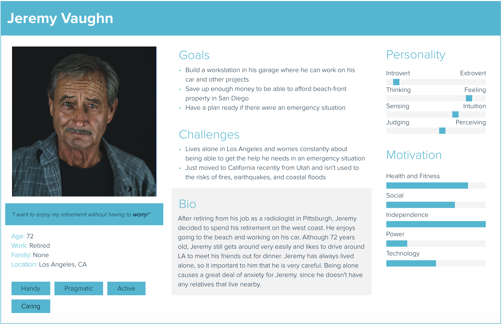
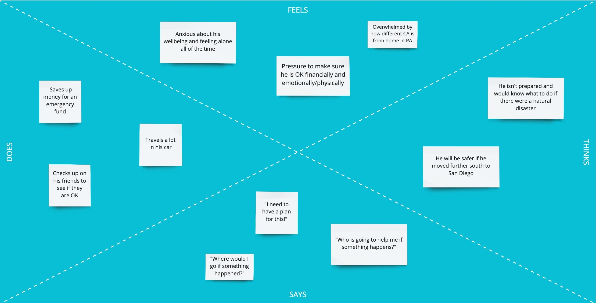
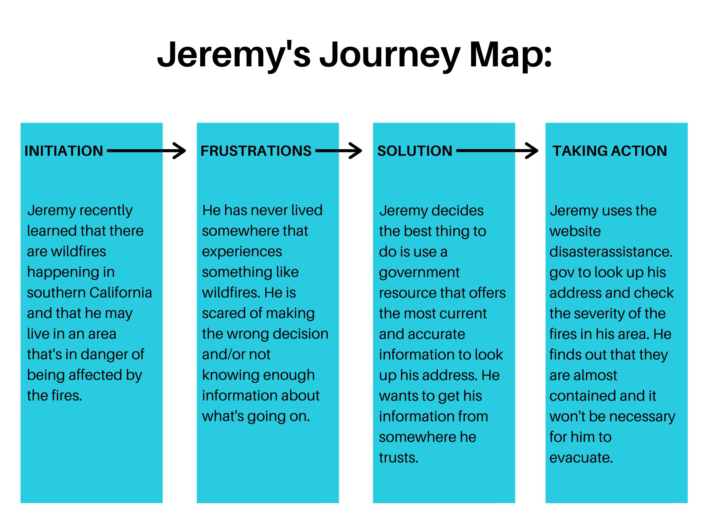

# Designing for Crisis Management
#### DH 250 - Advanced Topics in Digital Humanities: User Experience Design

My name is **Jake Tompkins** and I am a graduate student in UCLA's Department of Information Studies. This Github repository is for my UX  project surrounding the design of applications and websites used to find necessary information during a crisis or emergency. This project was inspired by my research interests in the field of [**Crisis (Disaster) Informatics**](https://en.wikipedia.org/wiki/Disaster_informatics).

## Assignment 1: Heuristic Evaluation

#### 1. [**Federal Emergency Management Agency (FEMA)**](https://apps.apple.com/us/app/fema/id474807486) Mobile Application

***App Description:*** This mobile application is used to receive emergency alerts and information so that users are prepared before, during, and after disasters. The app can be used to receive safety notifications, do-it-yourself emergency preparedness tips, and other disaster resources.

***Overall Evaluation:*** This application does not have a very great UI. The infrastructure for signing up for text alerts is very blackbox and difficult for users to understand what is going on. It is easy to make errors and nearly impossible to go back and correct actions once they are made. Various drop-down menus are nested within each other which makes it difficult for users to find the information they are seeking (all of the important information is there, it just isn't laid out neatly!)

<a href="FEMA.pdf" download>Download heuristic review for FEMA application</a> (PDF)

***
#### 2. [**DisasterAssistance.gov**](https://www.disasterassistance.gov/) Website

***App Description:*** This government resource is used to provide disaster survivors with information, support, services, and a means to access and apply for disaster assistance through join data-sharing efforts between federal, tribal, state, local, and private sector partners.

***Overall Evaluation:*** This website contains valuable information and links to important forms for users to fill out, but it is really difficult to navigate. When a user fills out the form their responses are not saved and they are required to either print a copy or email their responses to save them. Other resources on the website are rendered useless, for example the interactive map that users can look up their address to find local resources. This tool will produce results for resources located 400+ miles away that would be practically useless in the midst of an emergency and will not offer alternative options if there's nothing nearby.

<a href="DisasterAssistance.pdf" download>Download heuristic review for DisasterAssistance.gov website</a> (PDF)

## Assignment 2: Pilot Usability Test

#### Introduction

The DisasterAssistance.gov website is intended for people who have experienced (or expect to experience) some form of disaster. Information about various types of disasters, as well as resources available to help in the event of these disasters, are made available on the site. There are also applications for assistance built into the site so users can apply directly for various services and other forms of support.

After conducting a heuristic evaluation of the site, I recognized a few potential issues. Most notably, I noticed that the website's information architecture makes the website confusing to navigate. I also noticed issues with the application process for federal assistance. When users try to complete the application, it does not save their responses and encourages them to email themselves a copy or print the page. To assess the usability of the site, I have designed a usability test which challenges a potential user with realistic tasks to complete using the website.

#### Methodology

I will be doing a remote moderated usability test conducted via Zoom and recorded using Camtasia2020. I will be moderating the test remotely, while the participant completes the test from their home. We will communicate through Zoom while they complete the tasks I ask them.

I will begin the test with an introduction of who I am and why I have asked them to participate, followed by an icebreaker and asking if they have any questions before we begin. Once I have received informed consent from the participant, I will ask them to complete 3 separate tasks that a user would typically use the website for. Each of these 3 tasks have sub-tasks that I will break down for the user. At the end, I will have the participant answer some post-test questions to give me insights on their experience completing the 3 tasks. Within this section of the test, I will have the user select 5 cards that represent their overall experience with the website. Finally, before submitting their responses, I will have the user answer some (optional) confidential demographic questions to collect some extra data. Although their responses won't be shared, I will ask the user to only answer questions they feel comfortable with.

#### [Usability Test Survey Link](https://forms.gle/qKXMq1hXscVLrmya6)

#### [Video Link](https://drive.google.com/file/d/15J6SP75-ZX01PrvW18furalc15ZkCQwq/view?usp=sharing)

#### Reflection
During the usability test I found it really difficult not to answer the participant's questions when they felt frustrated. There were times when I expected the user to take a certain route, but her thought process took her in a different direction than what I had anticipated. In future UT's, I hope that I will do a better job not guiding the participant and letting them work through the task and problem solve on their own.

My primary concern with the UT was to see how well the user was able to use the navigation panel from the home page to find specific information for the tasks. As I expected, the participant clicked on pages that *seemed* to be correct, but actually led them away from the page of the website that they were looking for. From this UT, I believe there are several things that could be changed about the site to improve how quickly a user could find the information they need without the frustration of being misguided by the architecture of information currently used.

## Assignment 4: Contextual Inquiry
### The Design Challenge

#### What is the main activity your project would support the users in accomplishing?

The main focus of my project is to help users who have just experienced some type of disaster be able to identify resources that can support them. These resources can be informational, financial, or services available to users after being exposed to an emergency situation.

#### What is the basic need involved for that activity?

For this activity, a user needs urgent assistance (informational, financial, or via a service) in response to an emergency they have just experienced.

#### What are the current solutions available to satisfy those needs?

Alternatives are calling 911 or simple Google searches for specific forms of assistance. However, users who are in emergency situations may not know what type of assistance is available to them, so these resources can be:
* A.) time consuming to navigate if the user has lots of questions they need answered
* B.) not helpful for users who don't know what exactly they should search for and are struggling with a very stressful/intense situation that impacts their decision-making.

#### What are some limitations that would be improved with technology?

Having the right technology, users would be able to quickly find the information they need without having to know the right questions to ask. Users who have just experienced an emergency situation (or expect to experience one soon) typically struggle with decision-making because of how stressful and intense the situation can be.

---
### Target users

#### What are the characteristics of users?

Demographic: middle aged or older individuals who have/might experience(d) a disaster or emergency and require assistance

Preferences: users in these difficult situations usually need help right away

Expertise: users are not expected to have any specialized knowledge to use the app/website

#### Where would the users do that activity?

Users will often be looking for assistance from their homes using either a computer or their cellphone. However, if a user has just experienced a disaster that required them to evacuate, they may be completing the activity on their mobile device while traveling. If the user is currently experiencing a crisis, they may be in a difficult situation that is very distracting and hard to concentrate during.

#### What would users to do complete that activity?

To complete the activity, users may use their search browser on their computer or mobile device and begin searching questions about the disaster they are experiencing. Alternatively, if the situation is severe enough, a user may dial 911 to speak to someone directly who could help them.

***
### Research Methods

The research methods I employed for this assignment were through **participatory observation** with a follow up **interview** by directly asking the user some insightful questions.
* Through **participatory observation** I can directly observe a user completing a task to see how they would normally go about finding the information they need.
* I will also **interview** the user to ask them specific questions and have a discussion about what they would do in specific situations given there was an emergency.

***
### Research Materials

#### 1. [Contextual Inquiry Guide](https://docs.google.com/document/d/1WAjtJkYwqbcK53aXl0ua6d1wpnXyupdLlEAkvaZ0aOQ/edit?usp=sharing)

#### 2. [Session Recording](https://drive.google.com/file/d/1KxL-XrKt3ktd1s44nAcbu5HmsQTaizBJ/view?usp=sharing)

#### 3. [Transcription](https://otter.ai/note/23FYBUFYLSJR3XNY?f=)

***
### Insights from the interview
* User doesn't experience disasters frequently so isn't quite sure what to expect when searching them
* User finds URL's with .gov to be most useful and reliable when searching for information related to disasters
* If the user receives alerts about disasters she will usually adhere to the alerts, but won't investigate the disaster further by looking up online
* Unexpected things user said she looks up disasters for:
  * Finding information about damaged roofs for her work (selling roofs)
  * Checking up on disasters in areas where close friends live, as opposed to where she lives  
* User never mentioned wanting to look up assistance after experiencing a disaster (could be because she doesn't experience them often?)

***
### Reflection
I really enjoyed doing the contextual inquiry because it was more conversational and let me hear more about how the user feels about the topic of my project. It was kind of difficult at times because I would ask the user questions about how they would search for information about disasters, but the user lives in Ohio where natural disasters don't happen frequently so I could tell she was struggling to come up with answers for some of my questions. If I could do this type of research again, I would have liked to interview someone who experiences natural disasters frequently, like someone living in Florida who deals with hurricanes every fall, or someone in California who deals with earthquakes and wildfires. It would be helpful to talk with somebody who just recently experienced a disaster, so they could reflect on how that experience felt in more detail.

## Assignment 5: Persona and Scenario

### Purpose of UX Storytelling
Storytelling in UX is crucial to make sure your design team is keeping the user's needs front and center. Through storytelling, your team can concretely visualize **who** they are designing for and **why** their design is important.

***
### Key Design Features
1. An interactive visualization that tells users the severity of a disaster in their area and decisions they need to make immediately (if any)
2. Chat function that uses AI to guide the user to the right place to get the information they need

***
### Angelica Breit:
#### Persona

#### Empathy Map

#### Scenario
**Why is Angelica using this site?**
>Angelica is using this site because she wants to understand how severe the hurricanes and tropical storms are this season. She lives in an area that historically gets hit hard by these types of natural disasters and she wants to make sure that her and her family are prepared.

**How is Angelica using this site?**
>She is using the site to search for hurricanes to see what the different categories mean so she can understand what she heard on the news recently. She also wants to figure out if others in her area are evacuating or if it is safe enough to remain where they are and just shelter in place.

#### Journey Map

***
### Jeremy Vaughn:
#### Persona

#### Empathy Map

#### Scenario
**Why is Jeremy using this site?**
>One of Jeremy's friends said they smell smoke and see some ash covering the ground where they live. Jeremy isn't sure if he is in an area where there might be a fire. Being new to the area, Jeremy isn't exactly sure what to do if there is a fire in his area.

**How is Jeremy using this site?**
>Jeremy is searching his address to see if he is in an area that is in immediate danger from the fire. Jeremy is also curious if there are resources available that could help him recover his belongings if they got destroyed by the wildfire.

#### Journey Map

## Assignment 6: Low Fidelity Prototype

### Overview

**Purpose:** text

**User Personas:** text

**Features & Tasks:** text

### Wireframes and Wireflows

#### Notes on Wireflow test

**Task 1: ....**
> Text

**Task 2: ....**
> Text

**Task 3: ....**
> Text

**Task 4: ....**
> Text

**Task 5: ....**
> Text

### Summary
Text
