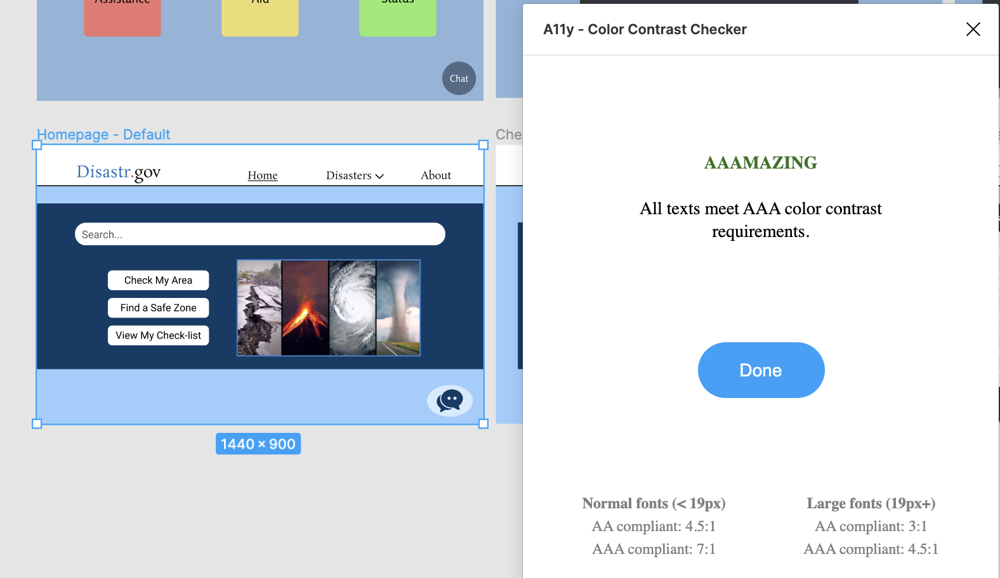

# Designing for Crisis Management
#### DH 250 - Advanced Topics in Digital Humanities: User Experience Design

My name is **Jake Tompkins** and I am a graduate student in UCLA's Department of Information Studies. This Github repository is for my UX  project surrounding the design of applications and websites used to find necessary information during a crisis or emergency. This project was inspired by my research interests in the field of [**Crisis (Disaster) Informatics**](https://en.wikipedia.org/wiki/Disaster_informatics).

## Assignment 1: Heuristic Evaluation

#### 1. [**Federal Emergency Management Agency (FEMA)**](https://apps.apple.com/us/app/fema/id474807486) Mobile Application

***App Description:*** This mobile application is used to receive emergency alerts and information so that users are prepared before, during, and after disasters. The app can be used to receive safety notifications, do-it-yourself emergency preparedness tips, and other disaster resources.

***Overall Evaluation:*** This application does not have a very great UI. The infrastructure for signing up for text alerts is very blackbox and difficult for users to understand what is going on. It is easy to make errors and nearly impossible to go back and correct actions once they are made. Various drop-down menus are nested within each other which makes it difficult for users to find the information they are seeking (all of the important information is there, it just isn't laid out neatly!)

<a href="FEMA.pdf" download>Download heuristic review for FEMA application</a> (PDF)

***
#### 2. [**DisasterAssistance.gov**](https://www.disasterassistance.gov/) Website

***App Description:*** This government resource is used to provide disaster survivors with information, support, services, and a means to access and apply for disaster assistance through join data-sharing efforts between federal, tribal, state, local, and private sector partners.

***Overall Evaluation:*** This website contains valuable information and links to important forms for users to fill out, but it is really difficult to navigate. When a user fills out the form their responses are not saved and they are required to either print a copy or email their responses to save them. Other resources on the website are rendered useless, for example the interactive map that users can look up their address to find local resources. This tool will produce results for resources located 400+ miles away that would be practically useless in the midst of an emergency and will not offer alternative options if there's nothing nearby.

<a href="DisasterAssistance.pdf" download>Download heuristic review for DisasterAssistance.gov website</a> (PDF)

## Assignment 2: Pilot Usability Test

#### Introduction

The DisasterAssistance.gov website is intended for people who have experienced (or expect to experience) some form of disaster. Information about various types of disasters, as well as resources available to help in the event of these disasters, are made available on the site. There are also applications for assistance built into the site so users can apply directly for various services and other forms of support.

After conducting a heuristic evaluation of the site, I recognized a few potential issues. Most notably, I noticed that the website's information architecture makes the website confusing to navigate. I also noticed issues with the application process for federal assistance. When users try to complete the application, it does not save their responses and encourages them to email themselves a copy or print the page. To assess the usability of the site, I have designed a usability test which challenges a potential user with realistic tasks to complete using the website.

#### Methodology

I will be doing a remote moderated usability test conducted via Zoom and recorded using Camtasia2020. I will be moderating the test remotely, while the participant completes the test from their home. We will communicate through Zoom while they complete the tasks I ask them.

I will begin the test with an introduction of who I am and why I have asked them to participate, followed by an icebreaker and asking if they have any questions before we begin. Once I have received informed consent from the participant, I will ask them to complete 3 separate tasks that a user would typically use the website for. Each of these 3 tasks have sub-tasks that I will break down for the user. At the end, I will have the participant answer some post-test questions to give me insights on their experience completing the 3 tasks. Within this section of the test, I will have the user select 5 cards that represent their overall experience with the website. Finally, before submitting their responses, I will have the user answer some (optional) confidential demographic questions to collect some extra data. Although their responses won't be shared, I will ask the user to only answer questions they feel comfortable with.

#### [Usability Test Survey Link](https://forms.gle/qKXMq1hXscVLrmya6)

#### [Video Link](https://drive.google.com/file/d/15J6SP75-ZX01PrvW18furalc15ZkCQwq/view?usp=sharing)

#### Reflection
During the usability test I found it really difficult not to answer the participant's questions when they felt frustrated. There were times when I expected the user to take a certain route, but her thought process took her in a different direction than what I had anticipated. In future UT's, I hope that I will do a better job not guiding the participant and letting them work through the task and problem solve on their own.

My primary concern with the UT was to see how well the user was able to use the navigation panel from the home page to find specific information for the tasks. As I expected, the participant clicked on pages that *seemed* to be correct, but actually led them away from the page of the website that they were looking for. From this UT, I believe there are several things that could be changed about the site to improve how quickly a user could find the information they need without the frustration of being misguided by the architecture of information currently used.

## Assignment 4: Contextual Inquiry
### The Design Challenge

#### What is the main activity your project would support the users in accomplishing?

The main focus of my project is to help users who have just experienced some type of disaster be able to identify resources that can support them. These resources can be informational, financial, or services available to users after being exposed to an emergency situation.

#### What is the basic need involved for that activity?

For this activity, a user needs urgent assistance (informational, financial, or via a service) in response to an emergency they have just experienced.

#### What are the current solutions available to satisfy those needs?

Alternatives are calling 911 or simple Google searches for specific forms of assistance. However, users who are in emergency situations may not know what type of assistance is available to them, so these resources can be:
* A.) time consuming to navigate if the user has lots of questions they need answered
* B.) not helpful for users who don't know what exactly they should search for and are struggling with a very stressful/intense situation that impacts their decision-making.

#### What are some limitations that would be improved with technology?

Having the right technology, users would be able to quickly find the information they need without having to know the right questions to ask. Users who have just experienced an emergency situation (or expect to experience one soon) typically struggle with decision-making because of how stressful and intense the situation can be.

---
### Target users

#### What are the characteristics of users?

Demographic: middle aged or older individuals who have/might experience(d) a disaster or emergency and require assistance

Preferences: users in these difficult situations usually need help right away

Expertise: users are not expected to have any specialized knowledge to use the app/website

#### Where would the users do that activity?

Users will often be looking for assistance from their homes using either a computer or their cellphone. However, if a user has just experienced a disaster that required them to evacuate, they may be completing the activity on their mobile device while traveling. If the user is currently experiencing a crisis, they may be in a difficult situation that is very distracting and hard to concentrate during.

#### What would users to do complete that activity?

To complete the activity, users may use their search browser on their computer or mobile device and begin searching questions about the disaster they are experiencing. Alternatively, if the situation is severe enough, a user may dial 911 to speak to someone directly who could help them.

***
### Research Methods

The research methods I employed for this assignment were through **user observation** with a follow up **interview** by directly asking the user some insightful questions.
* Through **user observation** I can directly observe a user completing a task to see how they would normally go about finding the information they need.
* I will also **interview** the user to ask them specific questions and have a discussion about what they would do in specific situations given there was an emergency.

***
### Research Materials

#### 1. [Contextual Inquiry Guide](https://docs.google.com/document/d/1WAjtJkYwqbcK53aXl0ua6d1wpnXyupdLlEAkvaZ0aOQ/edit?usp=sharing)

#### 2. [Session Recording](https://drive.google.com/file/d/1KxL-XrKt3ktd1s44nAcbu5HmsQTaizBJ/view?usp=sharing)

#### 3. [Transcription](https://otter.ai/note/23FYBUFYLSJR3XNY?f=)

***
### Insights from the interview
* User doesn't experience disasters frequently so isn't quite sure what to expect when searching them
* User finds URL's with .gov to be most useful and reliable when searching for information related to disasters
* If the user receives alerts about disasters she will usually adhere to the alerts, but won't investigate the disaster further by looking up online
* Unexpected things user said she looks up disasters for:
  * Finding information about damaged roofs for her work (selling roofs)
  * Checking up on disasters in areas where close friends live, as opposed to where she lives  
* User never mentioned wanting to look up assistance after experiencing a disaster (could be because she doesn't experience them often?)

***
### Reflection
I really enjoyed doing the contextual inquiry because it was more conversational and let me hear more about how the user feels about the topic of my project. It was kind of difficult at times because I would ask the user questions about how they would search for information about disasters, but the user lives in Ohio where natural disasters don't happen frequently so I could tell she was struggling to come up with answers for some of my questions. If I could do this type of research again, I would have liked to interview someone who experiences natural disasters frequently, like someone living in Florida who deals with hurricanes every fall, or someone in California who deals with earthquakes and wildfires. It would be helpful to talk with somebody who just recently experienced a disaster, so they could reflect on how that experience felt in more detail.

## Assignment 5: Persona and Scenario

### Purpose of UX Storytelling
Storytelling in UX is crucial to make sure your design team is keeping the user's needs front and center. Through storytelling, your team can concretely visualize **who** they are designing for and **why** their design is important.

***
### Key Design Features
1. An interactive visualization that tells users the severity of a disaster in their area and decisions they need to make immediately (if any)
2. Chat function that uses AI to guide the user to the right place to get the information they need

***
### Angelica Breit:
#### Persona

#### Empathy Map

#### Scenario
**Why is Angelica using this site?**
>Angelica is using this site because she wants to understand how severe the hurricanes and tropical storms are this season. She lives in an area that historically gets hit hard by these types of natural disasters and she wants to make sure that her and her family are prepared.

**How is Angelica using this site?**
>She is using the site to search for hurricanes to see what the different categories mean so she can understand what she heard on the news recently. She also wants to figure out if others in her area are evacuating or if it is safe enough to remain where they are and just shelter in place.

#### Journey Map

***
### Jeremy Vaughn:
#### Persona

#### Empathy Map

#### Scenario
**Why is Jeremy using this site?**
>One of Jeremy's friends said they smell smoke and see some ash covering the ground where they live. Jeremy isn't sure if he is in an area where there might be a fire. Being new to the area, Jeremy isn't exactly sure what to do if there is a fire in his area.

**How is Jeremy using this site?**
>Jeremy is searching his address to see if he is in an area that is in immediate danger from the fire. Jeremy is also curious if there are resources available that could help him recover his belongings if they got destroyed by the wildfire.

#### Journey Map

## Assignment 6: Low Fidelity Prototype

### Overview

**Purpose:** The purpose of this low-fidelity prototype is to understand how practical my proposed new features are for my target user demographic.

**User Personas:** The user personas I identified are older users who are likely to find themselves in a disaster and in need of help. These users are most likely to have valuable things in their lives (material or familial) that they would like to protect in the event of a disaster in their area. The goal of these new features is to help those users successfully do that.

**Features & Tasks:** The features and tasks of this low-fi prototype were ideated through various steps of user research, including usability testing of the current DisasterAssistance.gov site, contextual inquiry, and surveying a user interact with related sites. The two features include: an AI chat function that allows user to input data and get real-time answers, a check-list wizard that walks users through important action items, and an evaluation tool that tells a user how severe their situation is based on their location.

### Wireframes and Wireflows

First iteration of wireframes by hand:

***

Wireflows designed in Whimsical:

#### Notes on Wireflow test

### User 1 (Red):
**Task 1: Open chat**
> The user didn't have any difficulties identifying the chat option in the bottom corner of the homepage.

**Task 2: Ask for help using the chat**
> The user knew immediately where the typing bar was and could ask for help using it.

**Task 3: Accept help with creating a plan**
> The user clicked "Yes" when prompted in the chat without any confusion.

**Task 4: Work through the checklist**
> The user surprisingly knew they could check off items on the list. They stopped at "Evacuation plan" and knew to click on the link.

**Task 5: Accept the evacuation route**
> The user had no difficulties interpreting the map routing them from their current location to a safer place.

### User 2 (Blue):
**Task 1: Find help**
> The user noticed "find assistance" but wasn't sure if the green circle was a button or an image.

**Task 2: Enter your information to see how dangerous your area is**
> The user immediately knew where to enter their address, but there was no option to confirm (pressing OK or something) the user also wasn't sure if the slider was supposed to be adjusted by them or if it was supposed to tell them information.

**Task 3: Create an evacuation plan**
> The user was able to understand the map and confirm their route.

### Summary
For the most part, it was fairly easy for the users to complete the tasks I asked them. I completely forgot to incorporate "confirm" or "okay" buttons in some of the frames, which caused some confusion. It seemed like the users understood how to navigate the different frames and weren't too confused by the information presented.

If I were to go back and make adjustments, I would definitely add more buttons confirming selections. I was extra careful to include emergency exit buttons but forgot to include the option for users to confirm the information they enter!

## Assignment 7 Part I: High-Fidelity Prototype
### Description
The three sample screens I have provided include my homepage, checklist feature, and evacuation route mapping feature. For my first iteration (row 1) of the interface designs I wanted to see how the placement of my buttons, text, and pop-up screens looked. In the next iteration (row 2) I tried manipulating the color and typography to see if there were any fonts that stuck out to me as professional and user-friendly. Lastly, (row 3) I boldened the colors, implemented a monochromatic palette, and introduced more buttons so users could have more options to leave a screen or close a pop-up.

### Impression Test
I had a user review the different designs to get feedback along the way. They were able to markup the different screens with their thoughts and suggestions about the design and layout of the graphical interface. Based on their recommendations, I made changes with each iteration until landing on the final design in the final row.

### Compliance
Using the A11y - Color Contrast Checker plugin for Figma, I was able to check the color contrast to ensure my designs were accessibility WCAG2.0 AA compliant.

## Assignment 7 Part II: High-Fidelity Prototype

### Interactive Prototype: [Disastr.gov](https://www.figma.com/file/0jzW7usqVHhQD3B3pS1HXn/Disastr.gov?node-id=0%3A1)

### Brief Summary: Purposes and process
This is a high-fidelity prototype of a fictional government website called Disastr.gov that is meant to help anyone find valuable emergency information about natural disasters. The website has multiple functions, including a chat box to ask for help before, during, or after a disaster. Another function of the site is to help users look up information about disasters in their area and receive critical information about what they should do to prepare for any events happening near them and a check-list wizard that guides them through the preparation process.

### Interactive Prototypes Supported by the System
* List general information about different types of common disasters
* Search your address to see if there are any storms or disasters in your area along with critical information about its severity and suggested actions you should take
* Chat box that lets you ask specific questions that an AI bot will link you to the proper parts of the website that it decides is most helpful for the user
* A "Check-List Wizard" that guides the user through a series of emergency supplies that they are encouraged to have in preparation of a natural disaster
* Save an evacuation route to a nearby safety shelter from the user's home address they entered

### Prototype Design

#### Representative Screen Designs

#### Wireflow with Graphic Designs

### Graphical Interface Design Decisions

#### Color Scheme
Since this website is supposed to be modeled like a government site, I wanted to stick with a very professional looking color scheme and minimalize the amount of colors used. I decided to go with a blue palette for most of the screens and only incorporate colors like green and red for buttons to approve or deny an action. The homepage incorporates red, yellow, and green like a traffic light because it's familiar to all types of users and they can understand that red usually means something bad, yellow is more neutral, and green means something positive. I used an accessibility checker with Figma called the A11y - Color Contrast Checker, so I am certain that my designs would pass an accessibility test. I also used a light blue color to show which step or part of the screen a user was focused on in juxtaposition with a darker blue for other tasks or items in a list. For example, when a user is following the checklist they will see the first item is highlighted in lighter blue, then when they select the next item it will become light blue and the other items become dark blue again. I also used light grays and dark grays to indicate which step a user was on as they completed the process of searching their address to see disasters happening in their area.

#### Typography
For the home page I used a specific font to stand out for the menu to navigate to the home, disasters, and about pages. For the rest of the prototype I use a friendlier font that is consistent throughout, so the site looks professional and governmental.

### Feedback and Reflection

#### In class Cognitive Walkthrough
Using the [feedback](https://docs.google.com/document/d/1T8OhJi4BdyfwxzW_YU4qBjB_k1lbi28syh0660MAOWc/edit?usp=sharing) given from a classmate, I made sure to change my color scheme to indicate a more professional/governmental feel to the site. I also updated the Severity page to include a progress bar that shows the users progress as they locate the information they need.

I also shared my prototype with a few classmates last week during class and got verbal feedback about the aesthetics of the prototype and how I needed to make the functionality of the site more obvious from the homepage. I also included an interactive feature for the "Information" tab on the home menu so users knew the site was for disasters specifically, if that wasn't obvious already :)

As I created more screens, I realized how confusing it can be to remember how each of the screens link together. I often found myself accidentally linking to the wrong screen and when I went back to try using my prototype to complete an action, I'd end up in the wrong place and have to go back and see what I linked incorrectly. I also tried to include more options for users to go back to the homescreen at anytime and tried to be meticulous about where the "back" button vs. the "cancel" button took a user to where they realistically would want to go.
